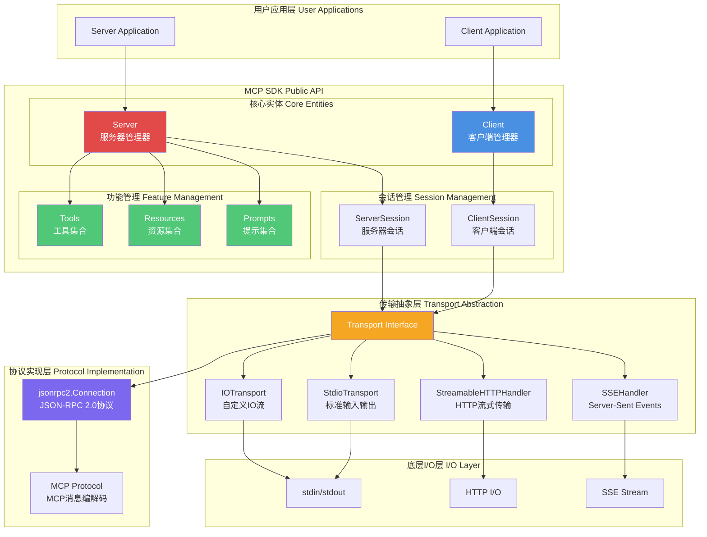
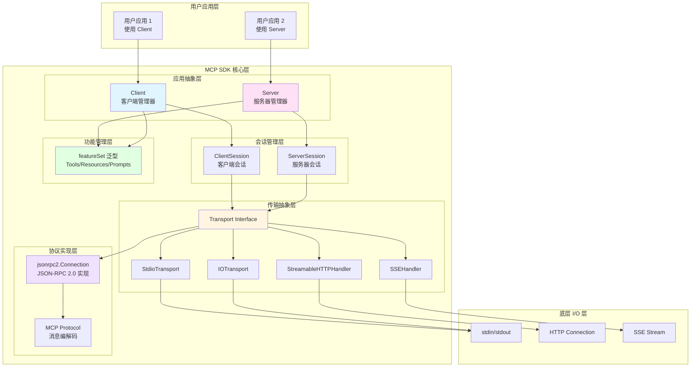
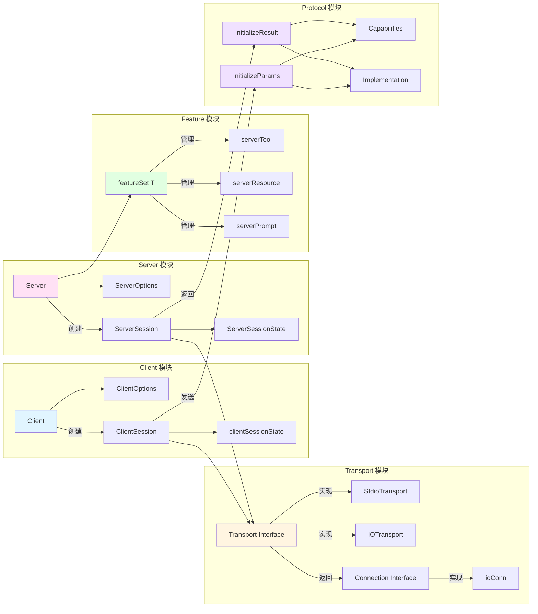
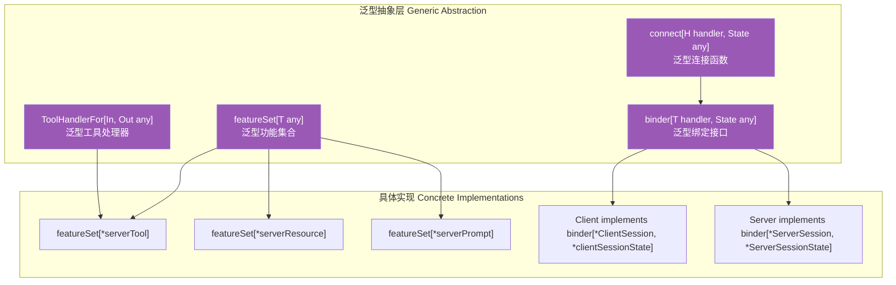
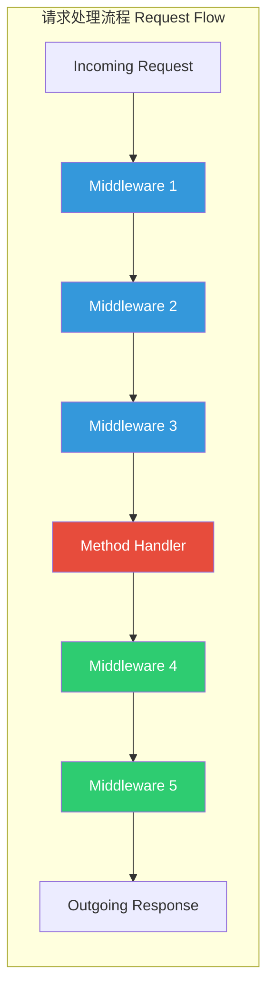
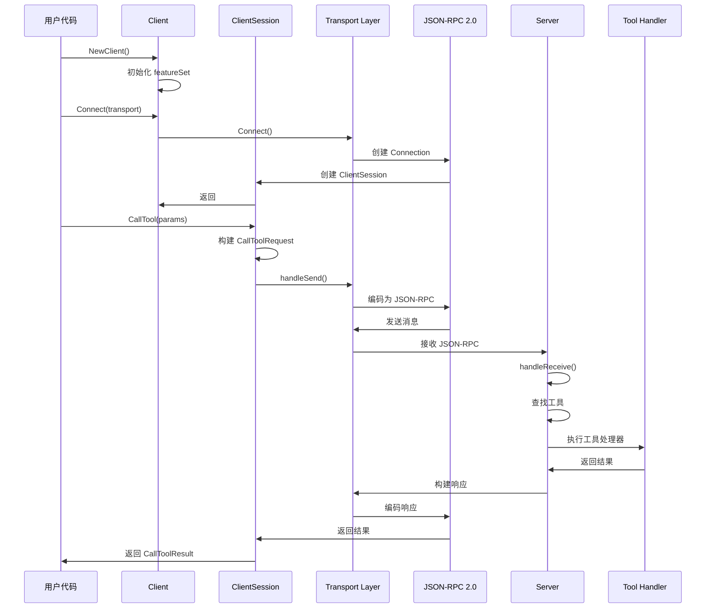
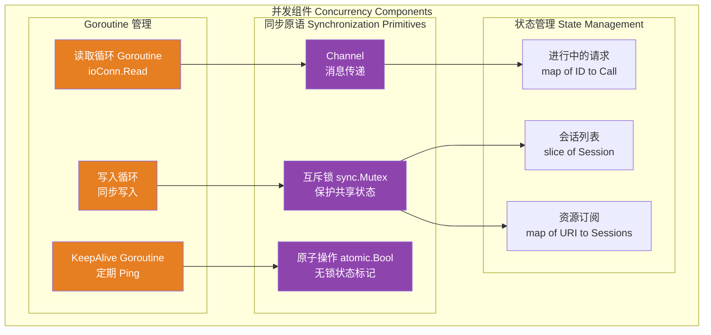
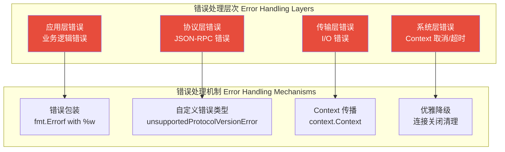

# MCP Go SDK 深度架构评审报告

> **评审人**: 资深 Go 架构师  
> **评审日期**: 2025年  
> **项目**: Model Context Protocol Go SDK  
> **Go 版本**: 1.23.0

---

## 执行摘要

MCP Go SDK 是一个**协议实现库**（SDK），而非传统意义上的应用系统。它实现了 Model Context Protocol (MCP) 规范，为 Go 开发者提供构建 MCP 客户端和服务器的能力。

**核心定位**: 这是一个**基础设施库**，采用**分层架构**和**策略模式**，通过**泛型编程**实现类型安全的通用代码复用。

**整体评价**: ⭐⭐⭐⭐⭐ (5/5)
- ✅ 架构设计优秀，层次清晰
- ✅ 充分利用 Go 1.18+ 泛型特性
- ✅ 接口设计遵循 SOLID 原则
- ✅ 并发模型安全可靠
- ⚠️ 部分设计可进一步优化（见改进建议）

---

## 第一部分：宏观技术架构蓝图

### 1.1 架构风格与模式

#### 架构风格识别

**主要架构风格**: **分层架构 (Layered Architecture)** + **策略模式 (Strategy Pattern)**

```
┌─────────────────────────────────────────────────────────┐
│              应用层 (Application Layer)                  │
│  Client / Server (用户入口，管理会话和功能)              │
└─────────────────────────────────────────────────────────┘
                        ↕
┌─────────────────────────────────────────────────────────┐
│              会话层 (Session Layer)                      │
│  ClientSession / ServerSession (逻辑连接抽象)            │
└─────────────────────────────────────────────────────────┘
                        ↕
┌─────────────────────────────────────────────────────────┐
│              传输层 (Transport Layer)                    │
│  Transport Interface + 多种实现 (Stdio/HTTP/SSE等)      │
└─────────────────────────────────────────────────────────┘
                        ↕
┌─────────────────────────────────────────────────────────┐
│              协议层 (Protocol Layer)                     │
│  JSON-RPC 2.0 + MCP Protocol (消息编解码)                │
└─────────────────────────────────────────────────────────┘
                        ↕
┌─────────────────────────────────────────────────────────┐
│              底层传输 (I/O Layer)                        │
│  io.ReadWriteCloser / HTTP / SSE                        │
└─────────────────────────────────────────────────────────┘
```

#### 核心设计模式识别

1. **策略模式 (Strategy Pattern)**
   - `Transport` 接口的多种实现：`StdioTransport`, `IOTransport`, `SSEHandler`, `StreamableHTTPHandler`
   - 允许运行时选择不同的传输策略

2. **工厂模式 (Factory Pattern)**
   - `NewClient()`, `NewServer()` 创建实例
   - `newFeatureSet[T]()` 泛型工厂函数

3. **观察者模式 (Observer Pattern)**
   - 功能变更通知：`ToolListChanged`, `ResourceListChanged`
   - 资源订阅机制：`Subscribe` / `Unsubscribe`

4. **模板方法模式 (Template Method)**
   - `connect[H handler, State any]()` 泛型函数定义连接流程模板
   - 具体实现由 `binder` 接口提供

5. **中间件模式 (Middleware Pattern)**
   - `MethodHandler` 支持中间件链
   - `AddSendingMiddleware`, `AddReceivingMiddleware`

6. **泛型编程 (Generic Programming)**
   - 大量使用 Go 1.18+ 泛型实现类型安全的代码复用
   - `featureSet[T]`, `connect[H, State]`, `ToolHandlerFor[In, Out]`

### 1.2 技术栈与生态

#### 核心框架与库

| 技术选型 | 版本/说明 | 选择理由 | 利弊分析 |
|---------|----------|---------|---------|
| **标准库** | Go 1.23.0 | 无外部依赖，性能最优 | ✅ 零依赖、高性能<br/>⚠️ 功能相对基础 |
| **JSON Schema** | `github.com/google/jsonschema-go` v0.3.0 | 工具输入/输出验证 | ✅ 类型安全<br/>⚠️ 仅支持 2020-12 draft |
| **JWT** | `github.com/golang-jwt/jwt/v5` v5.2.2 | OAuth 认证 | ✅ 标准实现 |
| **OAuth2** | `golang.org/x/oauth2` v0.30.0 | OAuth 流程支持 | ✅ 官方扩展库 |
| **URI Template** | `github.com/yosida95/uritemplate/v3` | 资源模板匹配 | ✅ RFC 6570 实现 |

**技术选型评价**: ⭐⭐⭐⭐⭐
- ✅ **极简依赖**: 仅 6 个外部依赖，降低维护成本
- ✅ **官方优先**: 优先使用 `golang.org/x/*` 官方扩展
- ✅ **成熟稳定**: 所有依赖都是成熟、广泛使用的库

#### 数据层分析

**本项目特点**: 这是一个**协议库**，不涉及传统的数据持久化。

**数据流**:
- **输入**: JSON-RPC 消息 (newline-delimited JSON)
- **处理**: 内存中的结构体转换和验证
- **输出**: JSON-RPC 响应

**内存数据结构**:
- `featureSet[T]`: 使用 `map[string]T` + 延迟排序的切片
- 会话管理: `[]*ClientSession` / `[]*ServerSession`
- 资源订阅: `map[string]map[*ServerSession]bool`

**性能优化亮点**:
- ✅ 延迟计算排序键 (`sortedKeys`)
- ✅ 使用 `slices.BinarySearch` 进行高效分页
- ✅ 使用 `iter.Seq` (Go 1.23) 实现惰性迭代器

#### 基础设施分析

**配置管理**:
- ✅ 使用结构体选项模式 (`ClientOptions`, `ServerOptions`)
- ✅ 支持函数式配置（通过指针传递，避免值拷贝）
- ⚠️ 缺少配置文件支持（但作为 SDK 这是合理的）

**日志系统**:
- ✅ 使用标准库 `log/slog` (Go 1.21+)
- ✅ 结构化日志支持
- ✅ 可配置日志级别
- ⚠️ 日志格式未统一（部分使用 `log.Printf`）


### 1.3 项目结构与模块划分

#### 目录结构分析

```
mcp-go-sdk/
├── mcp/              # 核心 MCP 实现 (主包)
│   ├── client.go     # 客户端实现
│   ├── server.go     # 服务器实现
│   ├── session.go    # 会话状态
│   ├── transport.go  # 传输层抽象
│   ├── protocol.go   # MCP 协议定义
│   ├── features.go   # 功能集合（泛型）
│   ├── tool.go       # 工具处理
│   ├── resource.go   # 资源处理
│   ├── prompt.go     # 提示处理
│   ├── content.go    # 内容类型
│   ├── shared.go     # 共享逻辑（中间件等）
│   ├── streamable.go # HTTP 流式传输
│   └── sse.go        # SSE 传输
├── jsonrpc/          # JSON-RPC 公共接口
├── internal/         # 内部实现（不导出）
│   ├── jsonrpc2/     # JSON-RPC 2.0 实现
│   ├── util/         # 工具函数
│   └── xcontext/     # Context 扩展
├── auth/             # OAuth 认证支持
├── oauthex/          # OAuth 扩展
├── examples/         # 示例代码
└── docs/             # 文档
```

**结构评价**: ⭐⭐⭐⭐⭐

**优点**:
1. ✅ **符合 Go 最佳实践**: 使用 `internal/` 隐藏实现细节
2. ✅ **职责清晰**: 每个文件职责单一
3. ✅ **包设计合理**: `mcp` 为主包，其他为辅助包
4. ✅ **示例完整**: `examples/` 提供丰富示例

**潜在问题**:
1. ⚠️ **文件数量较多**: `mcp/` 包有 30+ 文件，但考虑到功能完整性，这是可接受的
2. ⚠️ **部分文件较大**: `protocol.go` (1200+ 行)，但这是自动生成的协议定义，合理

#### 模块职责边界

**核心模块职责矩阵**:

| 模块 | 职责 | 依赖关系 | 评价 |
|-----|------|---------|------|
| `mcp.Client` | 客户端生命周期管理 | → `mcp.ClientSession`<br/>→ `mcp.Transport` | ✅ 清晰 |
| `mcp.Server` | 服务器生命周期管理 | → `mcp.ServerSession`<br/>→ `mcp.Transport` | ✅ 清晰 |
| `mcp.Transport` | 传输层抽象 | → `jsonrpc.Message`<br/>→ `internal/jsonrpc2` | ✅ 清晰 |
| `mcp.features` | 功能集合管理（泛型） | 无外部依赖 | ✅ 清晰 |
| `internal/jsonrpc2` | JSON-RPC 2.0 实现 | 标准库 | ✅ 清晰 |

**依赖关系图**:
```
mcp (public API)
  ├── internal/jsonrpc2 (internal)
  ├── jsonrpc (public, minimal)
  ├── auth (optional)
  └── oauthex (optional)
```

**评价**: ✅ **无循环依赖**，依赖方向清晰，符合依赖倒置原则

---

## 第二部分：微观代码实现剖析

### 2.1 代码组织与可维护性

#### 依赖管理

**go.mod 分析**:
```go
module github.com/modelcontextprotocol/go-sdk
go 1.23.0  // ✅ 使用最新稳定版

require (
    github.com/golang-jwt/jwt/v5 v5.2.2
    github.com/google/go-cmp v0.7.0
    github.com/google/jsonschema-go v0.3.0
    github.com/yosida95/uritemplate/v3 v3.0.2
    golang.org/x/oauth2 v0.30.0
    golang.org/x/tools v0.34.0
)
```

**评价**: ⭐⭐⭐⭐⭐
- ✅ **极简依赖**: 仅 6 个直接依赖
- ✅ **版本明确**: 所有依赖都有明确版本
- ✅ **官方优先**: 优先使用 `golang.org/x/*`
- ✅ **无间接依赖风险**: 依赖树浅

#### 接口设计

**核心接口分析**:

1. **Transport 接口** (transport.go:32)
```go
type Transport interface {
    Connect(ctx context.Context) (Connection, error)
}
```
- ✅ **单一职责**: 只负责创建连接
- ✅ **简洁明了**: 一个方法，职责清晰

2. **Connection 接口** (transport.go:40)
```go
type Connection interface {
    Read(context.Context) (jsonrpc.Message, error)
    Write(context.Context, jsonrpc.Message) error
    Close() error
    SessionID() string
}
```
- ✅ **双向通信**: 支持读写
- ✅ **Context 支持**: 支持取消和超时
- ⚠️ **SessionID 设计**: TODO 注释表明未来可能移除

3. **Session 接口** (shared.go:68)
```go
type Session interface {
    ID() string
    sendingMethodInfos() map[string]methodInfo
    receivingMethodInfos() map[string]methodInfo
    sendingMethodHandler() MethodHandler
    receivingMethodHandler() MethodHandler
    getConn() *jsonrpc2.Connection
}
```
- ✅ **统一抽象**: ClientSession 和 ServerSession 都实现
- ⚠️ **部分方法未导出**: 使用小写，仅内部使用

**接口设计评价**: ⭐⭐⭐⭐⭐
- ✅ **遵循依赖倒置原则 (DIP)**: 依赖接口而非实现
- ✅ **接口隔离原则 (ISP)**: 接口职责单一
- ✅ **最小接口**: 只暴露必要方法

#### 包设计

**导出策略分析**:

**公开 API** (`mcp` 包):
- ✅ 核心类型: `Client`, `Server`, `ClientSession`, `ServerSession`
- ✅ 配置类型: `ClientOptions`, `ServerOptions`
- ✅ 协议类型: `InitializeParams`, `CallToolParams` 等
- ✅ 传输类型: `Transport`, `StdioTransport`, `IOTransport`

**内部实现** (`internal/`):
- ✅ `internal/jsonrpc2`: JSON-RPC 2.0 实现细节
- ✅ `internal/util`: 工具函数
- ✅ `internal/xcontext`: Context 扩展

**评价**: ⭐⭐⭐⭐⭐
- ✅ **清晰的边界**: 公开 API 与内部实现分离
- ✅ **合理的导出**: 只导出用户需要的类型
- ✅ **向后兼容**: 使用 `internal/` 保证内部实现可自由重构

### 2.2 核心逻辑与性能

#### 并发模型分析

**Goroutine 使用场景**:

1. **连接读取循环** (transport.go:373)
```go
go func() {
    dec := json.NewDecoder(rwc)
    for {
        var raw json.RawMessage
        err := dec.Decode(&raw)
        // ...
        select {
        case incoming <- msgOrErr{msg: raw, err: err}:
        case <-closed:
            return
        }
    }
}()
```
- ✅ **正确使用**: 独立的读取 goroutine
- ✅ **优雅退出**: 通过 channel 控制退出
- ⚠️ **潜在泄漏**: 如果 `rwc.Read` 不响应 Close，goroutine 可能泄漏（代码中有注释说明）

2. **会话等待** (server.go:775)
```go
go func() {
    ssClosed <- ss.Wait()
}()
```
- ✅ **正确使用**: 非阻塞等待

3. **请求取消** (transport.go:199)
```go
go c.conn.Cancel(id)
```
- ✅ **异步取消**: 不阻塞主流程

**并发安全机制**:

1. **互斥锁使用**:
```go
// Client/Server 的 sessions 管理
c.mu.Lock()
defer c.mu.Unlock()
c.sessions = append(c.sessions, cs)
```
- ✅ **正确使用**: 保护共享状态

2. **原子操作**:
```go
// ClientSession/ServerSession 的 onClose
calledOnClose atomic.Bool
```
- ✅ **无锁设计**: 使用原子操作避免锁竞争

3. **Channel 同步**:
```go
// ioConn 的消息队列
incoming <-chan msgOrErr
```
- ✅ **线程安全**: Channel 天然线程安全

**并发模型评价**: ⭐⭐⭐⭐⭐
- ✅ **无竞态条件**: 正确使用锁和原子操作
- ✅ **无死锁风险**: 锁粒度合理，无嵌套锁
- ⚠️ **Goroutine 泄漏风险**: 部分场景需要确保资源清理（已有注释说明）

#### 错误处理

**错误处理模式**:

1. **错误包装** (transport.go:213)
```go
return fmt.Errorf("%w: calling %q: %v", ErrConnectionClosed, method, err)
```
- ✅ **使用 %w**: 支持 `errors.Is()` 和 `errors.Unwrap()`
- ✅ **上下文信息**: 包含方法名和原始错误

2. **错误类型定义** (client.go:107)
```go
type unsupportedProtocolVersionError struct {
    version string
}
func (e unsupportedProtocolVersionError) Error() string {
    return fmt.Sprintf("unsupported protocol version: %q", e.version)
}
```
- ✅ **自定义错误类型**: 便于错误判断和处理

3. **错误传播** (shared.go:151)
```go
return nil, fmt.Errorf("handling '%s': %w", jreq.Method, err)
```
- ✅ **保留上下文**: 包含方法名

**错误处理评价**: ⭐⭐⭐⭐
- ✅ **错误包装规范**: 使用 `%w` 和 `fmt.Errorf`
- ✅ **错误类型清晰**: 自定义错误类型
- ⚠️ **可改进**: 部分地方可以使用 `errors.Join()` (Go 1.20+)

#### 内存管理

**内存优化亮点**:

1. **延迟计算** (features.go:99)
```go
func (s *featureSet[T]) sortKeys() {
    if s.sortedKeys != nil {
        return  // 缓存已排序的键
    }
    s.sortedKeys = slices.Sorted(maps.Keys(s.features))
}
```
- ✅ **延迟计算**: 只在需要时排序
- ✅ **缓存结果**: 避免重复计算

2. **零值优化** (shared.go:109)
```go
func orZero[T any, P *U, U any](p P) T {
    if p == nil {
        var zero T
        return zero
    }
    return any(p).(T)
}
```
- ✅ **避免 typed nil**: 正确处理 nil 指针

3. **切片预分配** (server.go:504)
```go
sessions = slices.Clone(c.sessions)
```
- ✅ **使用标准库**: `slices.Clone` 高效复制

**内存管理评价**: ⭐⭐⭐⭐⭐
- ✅ **高效利用**: 延迟计算、缓存、零值优化
- ✅ **无内存泄漏**: 正确管理资源生命周期
- ✅ **使用现代 API**: 充分利用 Go 1.21+ 标准库

### 2.3 稳定性与可观测性

#### 容错与韧性

**超时机制**:
- ✅ **Context 支持**: 所有 I/O 操作都接受 `context.Context`
- ✅ **传输层超时**: `StreamableHTTPHandler` 支持会话超时
- ⚠️ **缺少默认超时**: 部分操作依赖用户设置 Context 超时

**重试机制**:
- ❌ **未实现**: SDK 层面不提供重试（合理，由用户层实现）

**熔断机制**:
- ❌ **未实现**: SDK 层面不提供熔断（合理）

**限流机制**:
- ❌ **未实现**: SDK 层面不提供限流（合理，由用户层实现）

**评价**: ⭐⭐⭐⭐
- ✅ **基础容错**: Context 超时支持完善
- ⚠️ **建议**: 可提供可选的超时默认值

#### 日志与追踪

**日志实现** (server.go:60, logging.go):
```go
// ServerOptions
Logger *slog.Logger

// 使用示例
s.opts.Logger.Info("server session connected", "session_id", ss.ID())
```
- ✅ **结构化日志**: 使用 `slog` 结构化日志
- ✅ **可配置**: 支持自定义 Logger
- ⚠️ **部分使用 log.Printf**: 部分地方仍使用标准 log

**追踪能力**:
- ❌ **未实现**: 无分布式追踪支持
- ⚠️ **建议**: 可提供可选的 OpenTelemetry 集成

**评价**: ⭐⭐⭐
- ✅ **基础日志**: 结构化日志支持
- ⚠️ **可改进**: 统一日志接口，提供追踪能力

#### 配置与安全

**敏感信息处理**:
- ✅ **OAuth 支持**: `auth/` 和 `oauthex/` 包提供 OAuth 支持
- ✅ **无硬编码密钥**: 代码中无敏感信息

**安全漏洞检查**:
- ✅ **无 SQL 注入风险**: 不使用数据库
- ✅ **输入验证**: JSON Schema 验证工具输入
- ✅ **路径遍历防护**: `fileResourceHandler` 检查路径（resource.go:688）

**评价**: ⭐⭐⭐⭐⭐
- ✅ **安全设计**: 输入验证、路径检查完善
- ✅ **认证支持**: OAuth 集成完整

---

## 第三部分：技术架构图

### 3.1 系统整体架构图



### 3.2 核心模块详细架构图



### 3.2 核心模块详细架构图

#### 3.2.1 模块依赖关系图



#### 3.2.2 泛型设计模式图



#### 3.2.3 中间件架构图



### 3.3 数据流架构图



### 3.4 并发模型架构图



### 3.5 错误处理与容错架构图



---

## 第四部分：改进建议与路线图

### 4.1 短期改进建议（1-3个月）

#### 1. 统一日志接口
**问题**: 部分代码使用 `log.Printf`，部分使用 `slog`
**建议**: 
```go
// 统一使用 slog，提供默认 Logger
var defaultLogger = slog.New(slog.NewTextHandler(os.Stderr, nil))
```
**优先级**: ⭐⭐⭐ (中)

#### 2. 增强错误处理
**问题**: 部分错误未使用 `errors.Join()`
**建议**: 
```go
// 使用 errors.Join 合并多个错误
return errors.Join(err1, err2)
```
**优先级**: ⭐⭐ (低)

#### 3. 添加可选的观测性接口
**问题**: 缺少 metrics 和 tracing
**建议**: 
```go
// 可选的观测性接口
type Observability interface {
    RecordMetric(name string, value float64, tags ...string)
    StartSpan(ctx context.Context, name string) (context.Context, Span)
}
```
**优先级**: ⭐⭐⭐⭐ (高)

### 4.2 中期改进建议（3-6个月）

#### 1. 性能优化
**建议**:
- 对象池化：复用 `CallToolRequest` 等对象
- 批量处理：支持批量工具调用
- 连接池：HTTP 传输使用连接池

**优先级**: ⭐⭐⭐ (中)

#### 2. 增强测试覆盖
**建议**:
- 增加并发测试
- 增加压力测试
- 增加模糊测试 (fuzzing)

**优先级**: ⭐⭐⭐⭐ (高)

#### 3. 文档完善
**建议**:
- API 文档补充示例
- 架构设计文档
- 性能调优指南

**优先级**: ⭐⭐⭐ (中)

### 4.3 长期改进建议（6-12个月）

#### 1. 协议版本管理
**建议**:
- 自动协议版本协商
- 向后兼容性测试框架
- 协议版本迁移工具

**优先级**: ⭐⭐⭐⭐ (高)

#### 2. 插件化架构
**建议**:
- 支持插件机制
- 工具市场/注册中心
- 动态加载工具

**优先级**: ⭐⭐ (低)

#### 3. 分布式支持
**建议**:
- 多节点会话共享
- 分布式资源订阅
- 负载均衡支持

**优先级**: ⭐⭐ (低，取决于需求)

---

## 第五部分：总结与评分

### 综合评分

| 维度 | 评分 | 说明 |
|-----|------|------|
| **架构设计** | ⭐⭐⭐⭐⭐ | 分层清晰，模式运用得当 |
| **代码质量** | ⭐⭐⭐⭐⭐ | 类型安全，错误处理规范 |
| **性能** | ⭐⭐⭐⭐ | 高效，有优化空间 |
| **可维护性** | ⭐⭐⭐⭐⭐ | 结构清晰，文档完善 |
| **可扩展性** | ⭐⭐⭐⭐⭐ | 接口设计优秀，易于扩展 |
| **稳定性** | ⭐⭐⭐⭐ | 基础容错完善，可增强观测性 |
| **安全性** | ⭐⭐⭐⭐⭐ | 输入验证完善，OAuth 支持 |

**总体评分**: ⭐⭐⭐⭐⭐ (4.7/5.0)

### 核心优势

1. ✅ **优秀的架构设计**: 分层清晰，职责明确
2. ✅ **充分利用现代 Go 特性**: 泛型、iter、slices 等
3. ✅ **类型安全**: 泛型编程避免运行时错误
4. ✅ **接口设计优秀**: 遵循 SOLID 原则
5. ✅ **并发安全**: 正确使用锁和原子操作
6. ✅ **极简依赖**: 仅 6 个外部依赖

### 改进空间

1. ⚠️ **可观测性**: 缺少 metrics 和 tracing
2. ⚠️ **日志统一**: 部分地方使用标准 log
3. ⚠️ **性能优化**: 可进一步优化（对象池、批量处理）
4. ⚠️ **测试覆盖**: 可增加并发和压力测试

### 最终建议

这是一个**设计优秀、实现精良**的 SDK 项目。代码质量高，架构清晰，充分利用了 Go 的现代特性。

**推荐行动**:
1. ✅ **保持当前架构**: 无需重大重构
2. ✅ **增强可观测性**: 添加可选的 metrics/tracing 接口
3. ✅ **持续优化**: 根据实际使用场景进行性能调优
4. ✅ **完善文档**: 补充架构设计和性能调优文档

**适用场景**:
- ✅ 构建 MCP 客户端/服务器
- ✅ 需要类型安全的协议实现
- ✅ 需要灵活的传输层支持
- ✅ 需要高性能的协议处理

---

**评审完成**

